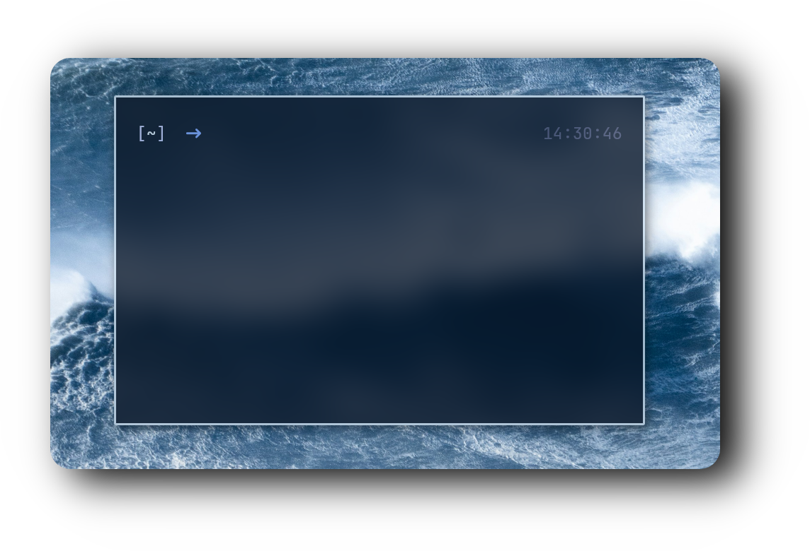

  <!-- Title -->
  <h1 style="font-size: 3rem; margin-bottom: 10px;">
    ⌨️ <strong>𝗙𝗜𝗦𝗛 ― 𝗖𝗢𝗡𝗙𝗜𝗚</strong> ⌨️
  </h1>

  <!-- Fish Shell Header -->
  <h2 style="font-size: 1.8rem; margin: 20px 0;">
    <a href="https://fishshell.com/" style="text-decoration: none; color: inherit;">
      
      Fish Shell
    </a>
  </h2>

<!-- Showcase Section -->

  <h2 style="font-size: 2rem; color: #444;">🎨 Showcase</h2>
  

    Below is a preview of my minimalist Fish configuration setup.
  

  

<!-- File Structure -->

  <h2 style="font-size: 2rem; color: #444; text-align: center;">📂 File Structure</h2>
  <pre style="background: #f7f7f7; padding: 20px; border-radius: 8px; color: #333; 
               font-size: 1rem; line-height: 1.6; overflow-x: auto;">
conf.d/
│── omf.fish
│
config.fish
│
fish_variables
  </pre>

<!-- Fonts Section -->

  <h2 style="font-size: 2rem; color: #444;">🖋️ Required Fonts</h2>
  

    Install a <a href="https://www.nerdfonts.com/font-downloads" 
                 style="color: #0073e6; text-decoration: none; font-weight: bold;">
      Nerd Font</a> to display all icons and symbols properly.
  

<!-- Inspiration Section -->

  <h2 style="font-size: 2rem; color: #444;">💡 Inspiration</h2>
  

    Designed for speed and minimalism, this configuration creates a clean and functional shell experience.
  

<!-- Footer -->

  
Crafted with ❤️ for developers who love a clean terminal.

