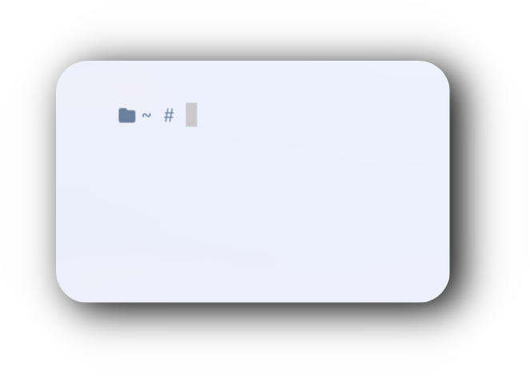

<div align="center">
  <!-- Fish Shell Header -->
  <h2 style="font-size: 1.8rem; margin: 20px 0;">
    <a href="https://fishshell.com/" style="text-decoration: none; color: inherit;">
      
      Fish Shell
    </a>
  </h2>
</div>


<div align="center">

### 𝙄𝙣𝙨𝙩𝙖𝙡𝙡𝙖𝙩𝙞𝙤𝙣 🥳

```
curl -fsSL https://raw.githubusercontent.com/user7210unix/fish-conf/main/install.sh | bash
```


<!-- Inspiration Section -->
<div align="center" style="margin: 40px 0;">
  <h2 style="font-size: 2rem; color: #444;">💡 Inspiration</h2>
  <p style="font-size: 1.1rem; line-height: 1.6; color: #555; max-width: 600px; margin: 0 auto;">
    Designed for speed and minimalism, this configuration creates a clean and functional shell experience.
  </p>
</div>

<!-- Showcase Section -->
<div align="center" style="margin: 40px auto;">
  
</div>

